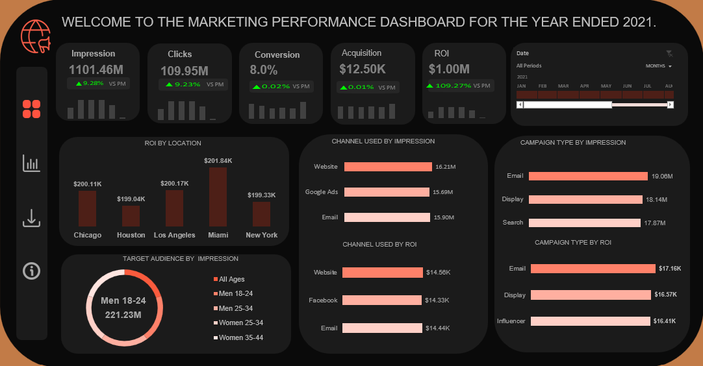
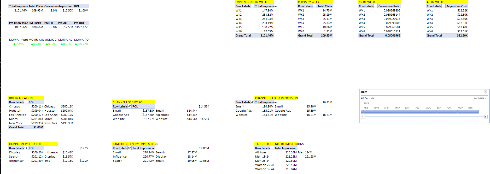

# Marketing Campaign Analysis

## Project Overview

This project analyzes marketing campaign data to evaluate campaign performance, customer behavior, engagement, and overall marketing effectiveness.

The analysis was completed in Microsoft Excel using data cleaning, exploratory analysis, PivotTables, charts, KPIs, and an interactive dashboard to transform campaign data into actionable business insights.

## Objectives

The analysis focuses on:

- Evaluating marketing campaign performance
- Understanding customer engagement and response behavior
- Identifying patterns across campaign-related metrics
- Comparing campaign performance across relevant segments
- Highlighting areas that may require further marketing attention
- Presenting findings through an executive-friendly dashboard

## Tools & Skills

- **Microsoft Excel**
- Data Cleaning & Preparation
- Exploratory Data Analysis
- PivotTables
- PivotCharts
- KPI Development
- Data Visualization
- Dashboard Design
- Marketing Analytics
- Customer Analysis
- Business Insights & Recommendations

## Project Workflow

1. **Data Preparation**
   - Reviewed and prepared the marketing campaign dataset
   - Standardized data for analysis
   - Organized the data into an analysis-ready structure

2. **Exploratory Analysis**
   - Examined campaign and customer-related metrics
   - Identified patterns and performance differences
   - Used PivotTables to summarize the dataset

3. **Dashboard Development**
   - Created KPI summaries
   - Developed charts to communicate campaign performance
   - Organized the analysis into an interactive Excel dashboard

4. **Insights & Recommendations**
   - Interpreted the analytical findings
   - Identified notable campaign and customer patterns
   - Developed recommendations based on the analysis

## Dashboard Preview



## Analysis

The project includes detailed analysis of the marketing campaign dataset, using Excel-based summaries, calculations, and visualizations to identify meaningful patterns in campaign performance and customer behavior.



## Key Insights & Recommendations

The project includes a dedicated insights and recommendations section that translates the analytical findings into potential business actions.


## Project Structure

```text
marketing-campaign-analysis/
│
├── data/
│   └── marketing_campaign_dataset.csv
│
├── images/
│   ├── analysis.png
│   ├── dashboard.png
│   └── insights&recommendations.png
│
├── marketing_campaign_analysis.xlsx
├── .gitignore
└── README.md
```
---

## 👤 Author

**Rachel Konadu Gyamfi**

Power BI • Data Analytics • Business Intelligence

---
Connect with me

LinkedIn: https://linkedin.com/in/rachel-konadu-gyamfi
GitHub: https://github.com/cyber-rachel
---
